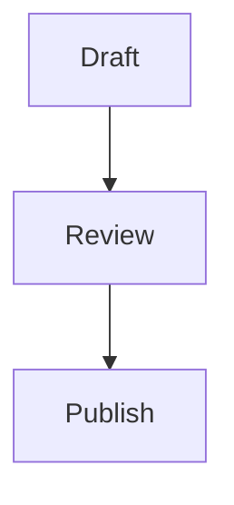

# Webdoc

webdoc is a lightweight static-site generator for durable written work. Prose and interactive components live in **one source artifact** from the start, rendered into a local website you can read, iterate on, and export. The source document stays canonical unless the user explicitly promotes the website as canonical.

## Default Behavior

- Always consider a website companion when offering a document, report, dossier, long research answer, handoff, or project status update.
- Autocreate and open a localhost preview for durable, long, visual, table-heavy, source-heavy, or repeatedly revisited artifacts unless the user requested text-only output.
- Apply the **Avoid AI Writing** rules (below) to every word you write into a site or doc.
- Prefer dense tables to bullets, and include the exact code snippet whenever you explain or refer to code.
- For anything that needs to show change over time (a clock cycle, a pipeline, an algorithm), build a **click-to-step state machine**, never a looping animation.
- If the agent wants the user to give feedback through the website, the feedback must save to durable local storage that the agent can read directly. Do not make the user copy/paste website input back into chat.
- Offer, but do not create, for short notes, email drafts, sensitive content, or cases where a second artifact could confuse provenance.
- Do not create a website when previewing would require network exposure beyond localhost, untrusted remote assets, or background services that cannot be cleaned up.
- Prefer static output. Use build tools only when the site needs real interactivity beyond what the `stepper`/`embed` blocks provide.

## Workflow

1. Identify the canonical source path and intended audience. If there is no file yet, create the canonical document first.
2. Decide create vs offer vs skip using the matrix below.
3. Plan the UI/UX of any interactive element **before** writing it. State the question each component answers and the simplest interaction that answers it. Do not spend tokens on hundreds of lines of custom HTML/CSS before this is settled.
4. Build the site:

   ```bash
   python3 scripts/create_site.py path/to/report.md
   ```

5. If the site was autocreated, user feedback is requested, or the user needs a hosted preview, start a localhost server (it auto-opens the browser unless turned off, see Auto-Open):

   ```bash
   python3 scripts/serve_site.py start ~/agent-artifacts/sites/<artifact-id>
   ```

6. Verify `index.html` exists. If a server is started, verify the reported `http://127.0.0.1:<port>/` URL returns successfully.
7. Report the canonical document path, website path, localhost URL when running, the `doc.html` export path and its Google Docs steps, any dropped features, the feedback storage path when enabled, and the cleanup command. Never kill a process by port alone.

## Decision Matrix

Autocreate and open the website when:
- The artifact is a report, dossier, handoff, research memo, project status file, or master summary.
- The artifact has dense tables, source lists, charts, comparisons, step-through explanations, or sections the user will scan repeatedly.
- The user asks for a website, dashboard, artifact, visual presentation, polished document, interactive explainer, or local preview.
- The agent asks the user to review or give feedback on the artifact in a local website.

Offer first when:
- The artifact is under roughly one page.
- The content is private, legally/medically/financially sensitive, or provenance-sensitive.
- The user asked for a message, email, PR text, short recap, or paste-ready text.
- Creating files or starting a server would be surprising in the current task.

Skip when:
- The user explicitly says no files, no website, text only, or chat only.
- The output is transient debugging narration or a tiny command result.
- The website would need non-local hosting, public sharing, or external network assets. A local-only site may carry secrets; never place secrets in a site that must be hosted or shared off this machine.

## Avoid AI Writing (always apply)

Write so the prose does not read as machine-generated. This is the operational core; the full ruleset (P0/P1/P2 severity tiers, ~80 patterns, context and voice profiles) is in `references/avoid-ai-writing.md`. Apply it. *Embedded from [conorbronsdon/avoid-ai-writing](https://github.com/conorbronsdon/avoid-ai-writing) (MIT); see `NOTICE`.*

- **Em dashes:** target zero, hard max one per 1,000 words, in headings too. Rewrite as commas, periods, or parentheses, or split into two sentences. Catch `—`, en dash `–`, and `--` (the linter exempts numeric ranges like 10–20).
- **No bold spam:** at most one bolded phrase per major section, or none. If it matters, restructure the sentence to lead with it.
- **Headings:** sentence case, no emoji. Use headers that say something specific, not "Overview / Key Points / Conclusion."
- **Bullets:** convert bullet-heavy prose into paragraphs. Bullets only for genuinely list-like content (this skill's own rule lists qualify).
- **Kill the formulae:** no "It's not X, it's Y"; no hollow intensifiers (`genuine`, `truly`, `really`, `it's worth noting that`); no hedging (`perhaps`, `could potentially`); vary the compulsive rule of three.
- **Tier 1 words, always replace:** delve, leverage, utilize, robust, comprehensive, seamless, embark, paradigm, realm, landscape (metaphor), tapestry, beacon, testament to, cutting-edge, pivotal, meticulous, game-changer, deep dive, unpack, showcasing, in order to, due to the fact that, serves as, boasts, underscores.
- **Tier 2, flag when 2+ cluster in a paragraph:** harness, navigate, foster, elevate, streamline, empower, facilitate, ecosystem, myriad, plethora, crucial, catalyze, reimagine, transformative, cornerstone.
- **Tier 3, flag at high density:** significant, innovative, effective, dynamic, compelling, unprecedented, exceptional, sophisticated.
- **Transitions to cut:** Moreover / Furthermore / Additionally; "In today's …"; "It's worth noting that" / "Notably"; "In conclusion / In summary"; "When it comes to"; "At the end of the day"; "That said."
- **Rhythm:** vary sentence length naturally, but do not chop prose into clipped 3-to-5-word declaratives; a run of very short sentences reads as manufactured drama, its own tell. Use a short sentence sparingly for emphasis, not as a default. Vary paragraph length too. Avoid formulaic openings ("In the rapidly evolving world of…") and generic future closers ("the future looks bright," "only time will tell").
- **No chatbot residue:** cut `Great question!`, `I hope this helps`, `Let's dive in`, `In this article we will explore`.
- **Attribution and copula:** cite a specific source or drop "experts believe / studies show"; prefer "is/has" over "serves as / boasts / represents."

Five principles for the rewrite: vary sentence length; be concrete (numbers, names, dates); have a voice; cut the neutrality; earn your emphasis. The replacement lists are defaults, not mandates. Keep a flagged word when it is genuinely the right one.

### Structural tells, and the second-pass audit (what the wordlist misses)

The lists above are word- and phrase-level. The tells that slip past them live in sentence structure, the rhythm rather than the vocabulary, and a wordlist cannot see them. Before you serve, run this counted audit over your own prose:

- **Negative parallelism ("X, not Y").** One is fine. Two or more in a paragraph ("it does not X; it Y", "not just A, but B") means rewrite to the positive claim.
- **Stacked negation** climbing to an abstraction ("Not a tool. Not a feature. A revolution.") collapses to one plain sentence.
- **Rule of three:** at most one tricolon per passage; vary or cut the rest.
- **Signpost openers** (`Below is`, `Here is how`, `Here's the thing`): delete the announcement and state the thing.
- **"The X of Y" aphorism** ("the power of", "the art of"): replace with the concrete claim.
- **Manufactured punchline:** a short standalone closer after a long sentence, for drama. Cut it; let the result stand.
- **Staccato and burstiness:** vary sentence length, but do not chop into a run of clipped short sentences ("Amylose is long. It is straight."); that reads as manufactured drama. The linter flags runs of very short sentences; connect them.

webdoc enforces the deterministic part automatically: `create_site.py` runs `scripts/lint_prose.py` (native Python, no dependency) before building and blocks on the high-precision tells (stacked negation, signpost openers, em/en dashes and double-hyphens), surfacing the rest as warnings: negative parallelism, tricolon, "the X of Y" aphorism, AI vocabulary, generic temporal openers, the "While X, it also Y" hedge, and staccato runs. Bypass with `--no-lint` only when you mean it. Full catalogue, before/after, and sources: `references/structural-tells.md`.

## Dense Information

- Prefer **tables over bullets** to pass information densely: comparison matrices, spec sheets, bit-field/register tables. A table the reader can scan beats a wall of bullets.
- When one option has a clear advantage in a field, **bold the advantageous value** with `**…**` so the winner is obvious at a glance.
- When context warrants Google-Sheets-style good/bad signaling, lead a table cell with a marker: `[+]` renders green, `[-]` red, `[~]` amber. Example row: `| p95 latency | [+] **12 ms** | [-] 380 ms |`. These inline-style through to the Google Docs export.
- When you explain or refer to code, include the **exact snippet** in a fenced code block, not a paraphrase.

## Interactivity

Plan the UX first (see Workflow step 3). Then author components inside the single source with two fenced blocks.

**Step-through state machine**: for clock cycles, timelines, pipelines, algorithms. The reader clicks to advance one step; nothing loops. Steps are split on `---`:

````
```stepper title="Clock cycle walkthrough"
Cycle 1 — fetch the instruction at the program counter.
---
Cycle 2 — decode the opcode and read the source registers.
---
Cycle 3 — the ALU computes the result and writes it back.
```
````

webdoc generates the controls and includes `stepper.js`. In the doc export the steps flatten to a numbered list, so the information survives even without the interaction.

**Raw embed**: for audio/music, photo galleries, toggles, or any custom HTML/JS/CSS:

````
```embed
<audio controls src="assets/intro.mp3"></audio>
<details><summary>Show the full derivation</summary><p>…</p></details>
<div class="gallery"></div>
```
````

Embeds are injected verbatim (local-only; never host an embed that carries secrets off this machine). Bundle files with flags: `--asset clip.mp3` copies into the site's `assets/` (reference it as `assets/clip.mp3`); `--css custom.css` and `--js widget.js` bundle and link extra styles/scripts.

**Mermaid diagram**: for a quick flowchart, sequence, or graph, use a `mermaid` fence. The website renders it client-side with the vendored library:

````

````

The doc export runs no scripts, so there it shows the diagram source as a code block instead. When the diagram must appear in the Google Doc, pre-render it to SVG (see `references/diagramming.md`).

**Video**: a bare `<video ...>` inside an embed is all you need. `create_site.py` detects it and bundles `review-player.js`/`review-player.css`, which turn every `<video>` on the page into a review player: a large surface sized to the content column, a real scrub bar with the buffered range, and keyboard transport (space play/pause, `←`/`→` seek 5s, `Shift+←`/`→` seek 1s, `,`/`.` step one frame at 29.97fps, `[`/`]` cycle speed 0.5-2x, `m` mute, `f` fullscreen, `i`/`o` set an A/B loop's in and out points, `l` toggle the loop, so a reviewer can replay one join over and over). Any `[m:ss]` or `[m:ss.f]` text on the page becomes a link that seeks the nearest preceding player and plays from there. Write those timecodes against the *embedded video's own* timeline; when the video is a sampler compiled from windows of a longer render, compute each window's offset in the sampler rather than reusing the render's timecodes. If the script fails to load, `<video controls>` keeps its native controls and still plays. Seeking local video relies on the server's HTTP Range support in `serve_site.py`.

**Black or stuck video:** the player has a **Reload video** button that reloads the same media element and keeps position, playback state, speed and audio settings, with a 15-second timeout. Page notes and any external video listeners stay intact. It is a manual recovery, not a fix for whatever caused the blackout. Before using it, capture the picture, timestamp, media state and the exact served file; `readyState:4` and `error:null` do not prove a visible picture. A full page reload is the fallback, so save any unsent notes first.

Never use looping CSS keyframes or GIFs for technical content. They are noisy and hard to read. A `stepper` is almost always the better tool.

## Concept Variations

For a substantial animation or rich interactive visual, or whenever the user asks, do not commit to the first idea. Generate at least five distinct concepts and let the user choose. Skip this for trivial bits (a single toggle, a fade); build those directly.

1. Plan the UX: write the question the visual answers and five genuinely different ways to answer it (discrete stepper, annotated timeline, before/after toggle, layered build-up, interactive diagram). Different approaches, not restyles of one.
2. Build each concept as its own webdoc site (a separate `create_site.py` run into its own dir). You can generate the concepts in parallel with subagents.
3. Assemble a gallery the user flips through on one page:

   ```bash
   python3 scripts/gallery.py --out ~/agent-artifacts/sites/<id>-gallery --title "Clock cycle" \
     --concept "Discrete steps=<site_a>" --concept "Annotated timeline=<site_b>" --concept "Before/after=<site_c>"
   ```

4. Serve the gallery dir (it auto-opens). The user clicks tabs to compare, pops any concept out full-screen, and presses "Choose this concept". The pick lands in the gallery's `feedback.jsonl`.
5. Read `feedback.jsonl` for the `CHOSEN:` line, then build the final artifact around that concept.

## Doc Export And Fidelity

Every build also writes a single self-contained `doc.html` (all CSS inline, no scripts, images embedded as data URIs) for Google Docs.

- Tell the user the exact path: **upload `doc.html` to Google Drive, then right-click it → Open with → Google Docs.** (There is no reliable in-Docs "Import HTML"; the Drive route is the one that works.)
- `create_site.py` reports `doc_export.dropped_features`. When it is non-empty, **say so plainly in chat**: list which interactive/audio/video/custom-JS/image bits will not appear in the Google Doc. This is the "if we're going too crazy, tell the user" check. The website keeps everything; the Doc keeps text, tables (with bold + red/green), code, and headings.
- If the user needs the rich media in a portable file, note that **PDF can embed audio** (and more), though it plays only in some viewers such as Acrobat. Offer it as the richer-but-heavier alternative.

## Auto-Open

`serve_site.py start` opens the site in the browser when the server is up, so it lands in focus. The toggle lives in `~/.config/webdoc/settings.json` (user-owned, outside the repo):

```json
{ "auto_open": true }
```

Set `auto_open` to `false` to stop auto-opening. Per run, `--open` / `--no-open` override the config. Only loopback URLs are ever opened.

**The user's everyday browser, never a testing one.** On macOS the URL goes to a pinned bundle (`open -b <bundle id>`, the registered http handler) instead of bare `open`. A testing build such as Chrome for Testing or plain Chromium is never accepted as that target, even if it registered itself as the handler; the everyday Google Chrome is used instead. Tab reuse ignores any browser whose only running instances were launched by a test harness (`--remote-debugging-*`, `--headless`, `--enable-automation`, a Playwright profile), because those instances answer AppleScript for the same app bundle and their tabs are not the user's.

**One tab per site.** Showing a site never stacks up tabs. `start` first asks the running browsers (Chrome and its relatives, Safari) whether one of their tabs is already on this site, including a tab left on an earlier run's port, which gets retargeted to the new URL and focused. A new tab opens only when none exists. Serving a site that is already being served reuses its tab, and a restart keeps the previous port when it is free so an open tab stays live. When no browser can answer (none is running, automation permission is denied, or a headless automation copy answers instead of the user's), the site falls back to what it recorded in `tabs.json` and does not re-open a URL it opened within the last 8 hours; `--open` forces a fresh tab if the user closed theirs. `stop` closes the site's tab so nothing is left pointing at a dead port, and `--keep-tab` leaves it. Every browser call is time-boxed and best-effort: a browser that hangs or refuses costs a couple of seconds at most and never takes the server down.

## Templates

A template is a complete stylesheet that swaps webdoc's look (color, type, spacing) without touching the content. Pick one with `--template`:

```bash
python3 scripts/create_site.py report.md --template standard
python3 scripts/create_site.py report.md --template ./fashion-theme.css   # try a deviation
```

Only `standard` ships with the skill. To deviate for a kind of work (a fashion-trends look, a finance look), author a complete stylesheet and build with `--template ./that.css`. If it works for the user, offer to save it as a reusable category:

```bash
python3 scripts/templates.py save fashion-trends --from ./that.css
python3 scripts/templates.py list
```

Saved categories live privately under `~/.config/webdoc/templates/<name>/` (never uploaded). Reuse one with `--template fashion-trends`; a team gets a cohesive look by copying that directory. Templates control theme only. Structural/layout templates are out of scope for now.

## Smash or Pass (design triage decks)

When the user is exploring a design direction (a new visual element, a style, a layout) and taste decides it, offer a **smash-or-pass deck** instead of a static gallery: generate about 10 to 20 genuinely distinct variants as images, build a Tinder-style swipe site, and read the votes back from durable storage. Offer it proactively; the user should not have to remember it exists.

```bash
# DECK_DIR: deck.json {"title","round","cards":[{"id","image","name","note"}]} + the images
python3 scripts/smash_or_pass.py DECK_DIR --out SITE_DIR --title "..."
python3 scripts/serve_site.py start SITE_DIR
```

- Controls: `→` smash, `←` pass. Typing any letter focuses the note box, and the note is saved with that card's swipe. Cmd/Ctrl+`→`/`←` swipes even mid-note, Cmd/Ctrl+Z undoes, Esc leaves the note. Votes append to the site's `feedback.jsonl` (`VOTE: smash|pass` + `NOTE:`); the latest vote per card wins, and a reload resumes mid-deck.
- Cards are images by default. A card with `"text"` (plus an optional `"detail"`) in place of `"image"` renders as a text proposition, for decision or question decks where smash means yes and pass means no.
- **The loop is the point.** Read the votes, work out what the smashes share and what the notes say, then generate the next round *toward* that pattern: append the new cards to `deck.json` and bump `"round"` while the server runs. The page polls every 5 seconds, shows a toast, and deals them in.
- Slow generation: append `{"id":"__pending__","eta":"~2 min"}` so the end screen says the next round is coming instead of "done", and replace it with real cards when they are ready.
- **Watch for the end of a round.** When the user finishes a round, the page POSTs a `__deck_complete__` sentinel (with the round number and tallies) into `feedback.jsonl`. Right after serving a deck, set up a watch on that file for the current round's sentinel (a file monitor, or whatever wake-up mechanism your agent harness offers) so the agent wakes to read the votes and build the next round. Without it, votes sit unread until the user complains.
- Card images should be honest renders in real context (for example composited over an actual video frame), not idealized art. The vote is only as good as the mockup.

## Asset Triage (audit existing placements)

The sibling of Smash or Pass, for **auditing a batch of items that are already placed** (overlays on a timeline, staged b-roll) rather than exploring new directions. Show one card per item, **composited in its real context** (host frame plus overlay, never the bare asset), with a one-line rationale for why it was chosen, carousel-style.

- Keyboard-only, and silence means consent: the right arrow advances and keeps anything without feedback, Enter accepts explicitly, and typed notes attach to the current item. Too much clicking is the failure this avoids.
- Feedback persists per item to the site's durable storage for the agent to read, with the same `feedback.jsonl` and end-of-round sentinel rules as Smash or Pass.
- There is no bundled script for this yet; build it on the Smash or Pass site as a starting point.

## Persistent Website Feedback

Use the persisted-feedback pattern: the browser UI is not the source of truth; user actions POST to a localhost API and the server writes durable local state.

- Generated websites include a feedback form.
- When served with `scripts/serve_site.py`, `POST /api/feedback` appends to `feedback.jsonl` in the site directory.
- The agent reads `feedback.jsonl` directly after the user submits feedback. The user should not copy/paste the feedback into chat.
- Browser `localStorage`, unsent textarea contents, or DOM state are not durable enough.
- A feedback script reused across rebuilds reads the build or version id from the page, never a constant, and refuses to post without one. Otherwise answers to a rebuilt page get filed under the old build.
- For richer workflows, use SQLite or another explicit local store, but keep the same rule: website input must become agent-readable local state.

## Editing Mode

A served site can be edited in place. Click **Edit** (top right), then click any paragraph, heading, list item, or table cell to fix its text inline; a small toolbar offers bold, italic, inline code, and link (Cmd/Ctrl+B/I, Cmd/Ctrl+Enter saves, Esc cancels). Each save round-trips surgically into the canonical `.md` and the source stays canonical. Embeds, diagrams, the stepper, and fenced code are view-only. Editing is loopback-only: open the served site via `127.0.0.1` or `localhost` on the machine serving it. Viewing over the LAN still works, but the in-page editor stays disabled there and says why, because a save writes to your source file.

How it works, so the pieces line up:

- `create_site.py` emits per-block identity on editable blocks in `index.html` only (never `doc.html`): `data-md-start`/`data-md-end` (1-based inclusive source line range), `data-md-hash` (short sha256 of the exact source slice), `data-md-type`. Table cells carry `data-md-line`/`data-md-cell`/`data-md-hash` instead. View-only blocks get `data-noedit`.
- The browser POSTs the edited block's HTML to `POST /api/edit`. Guards (no session key): the connecting TCP peer must be loopback (the authoritative, unspoofable check, enforced even under `--allow-lan` since this writes to your source file) plus a loopback `Host` header (DNS-rebinding defence) and a body size cap. The server re-reads the source slice, **checks the hash** (a mismatch means the file changed under the open tab and returns `409` without writing), converts the HTML back to Markdown through a strict whitelist (bold, italic, inline code, link, line break; everything else becomes plain text, and `javascript:`/`data:`/`vbscript:` links are dropped), re-wraps it with the block's structural prefix (heading `#`s, list marker, table pipes), writes the `.md` atomically (preserving its LF/CRLF line endings), lints the new text (advisory, never blocks), and re-renders just that block.
- The save target is always the manifest's `source_path` and nothing else.

### Agent contract: do not clobber human edits

Every human edit is recorded in a sibling ledger `<source_stem>.edits.json` (block identity + `content_hash` + timestamp + excerpt). Before any agent pass rewrites a block (a humanizer sweep, a regeneration, a bulk fix) it **must** check the ledger and must not silently overwrite a block a human edited:

```python
import sys; sys.path.insert(0, "scripts")
from edit_support import check_overrides
if check_overrides(source_path, current_block_markdown):
    # a human authored this block — flag or ask, do not overwrite
    ...
```

`check_overrides` keys on the block's content hash, so it keeps working as the rest of the document shifts. The human override always wins; an agent that ignores this is a bug.

## Visual Explanation Guidance

Prefer a diagram whenever a relationship is structural, comparative, a flow, a mechanism, a magnitude, or a change over time. Reach for one by default for those, not only when prose fails; skip it only when the content is genuinely linear. No decorative charts. **For the full system (Okabe-Ito style grammar, the self-contained offline scoped-embed contract, the stepper recipe, the build-with-subagents pattern, the token-budget gotcha, and the render/verify gates), read `references/diagramming.md`. Follow it for any non-trivial diagram or interactive visual.**

- **Data charts:** hand-authored inline SVG, or Observable Plot / Vega-Lite pre-rendered, with explicit data and chart spec, injected via an `embed` block. Magnitudes over many orders of magnitude use dots/lollipops on a log axis, never filled bars.
- **Static system/process diagrams:** hand-authored SVG when layout precision matters (the usual choice for topology and mechanism); D2/Graphviz pre-rendered to SVG otherwise. A `mermaid` fence now renders in the website via the vendored library, so reach for it when a quick flowchart or sequence diagram is enough; pre-render to SVG when the diagram must survive the `doc.html` export.
- **Change over time / mechanism:** use a `stepper` (click-to-advance), not animation; draw the scene once and toggle classes per step (see the stepper recipe). If motion is genuinely required, keep it user-triggered with a reduced-motion fallback and a static fallback frame, never an infinite loop.

Prompting rules: state the question each visual answers before choosing a form; specify data fields, units, encodings, sort order, and what to leave out; separate data transformation from visual encoding; render and critique the result for accuracy, labels, axes, contrast, and responsive sizing. Keep all visual source beside the website so future agents can edit it.

## Storage And Hosting

- Default generated websites live under `~/agent-artifacts/sites/<artifact-id>/`.
- The artifact id is stable per source path by default; use `--snapshot` when a time-stamped copy is desired.
- Each generated website includes `manifest.json` with source path, source hash, output path, generated time, title, feedback path, and the `doc_export` block.
- Hosted previews must bind to `127.0.0.1` by default. Require explicit user intent for LAN exposure.
- Use OS-assigned ports by default and write the resolved URL to `server.json`.
- Stop only servers recorded in a manifest and owned by this workflow. Never kill "whatever owns port 3000".
- Background servers shut themselves down. The served page sends a heartbeat, so the server stops on its own about 30 minutes after the last open tab goes away (`--idle-timeout`, `0` disables). A 7-day TTL backstops that (`--ttl`, `0` disables), and explicit `stop` always works. `server.json` records why it stopped in `shutdown_reason` (`idle`, `ttl`, or `signal`).
- Avoid symlinks in generated website directories. Local static servers can follow symlinks and escape the intended tree.

## Scripts

- `scripts/create_site.py`: Convert a Markdown/report source into a unified static website (`index.html`, `style.css`, `manifest.json`, feedback UI) plus the self-contained `doc.html` export. Supports `stepper`/`embed` blocks, `[+]/[-]/[~]` table cells, `--template`, and `--css/--js/--asset` bundling.
- `scripts/serve_site.py`: Start, stop, inspect, or clean up a localhost-only preview server with `server.json`, durable `feedback.jsonl`, config-driven auto-open that reuses the site's existing tab, heartbeat-driven idle shutdown (default 30 minutes after the last tab closes), and a 7-day TTL backstop.
- `scripts/templates.py`: List built-in templates and save a stylesheet as a private reusable category.
- `scripts/gallery.py`: Assemble a concepts gallery (one switcher page over several built concept sites) for the Concept Variations workflow.
- `scripts/smash_or_pass.py`: Build a Smash or Pass swipe deck from a `deck.json` of image or text cards; votes and notes land in `feedback.jsonl`.
- `scripts/browser_tabs.py`: Find and reuse the browser tab a site is already open in (retargeting a tab left on an old port), or close it. Best-effort AppleScript on macOS, time-boxed, never launches a browser.
- `scripts/settings.py`: Read user config from `~/.config/webdoc/settings.json`.
- `scripts/lint_prose.py`: Native prose linter (no external binary, pure stdlib) that flags structural AI-writing tells. Run automatically by `create_site.py` as a build gate; also runnable standalone (`python3 scripts/lint_prose.py file.md`, with `--warn-only` / `--json` / `--no-lint`). Rules and severities live in `lint/rules.json`.
- `scripts/edit_support.py`: Editing-mode server round-trip: `apply_edit(source_path, payload)` (validate, hash-check for drift, write the `.md` atomically), the override ledger, and `check_overrides` (the anti-clobber contract). Reuses `create_site`'s renderers so the page and the server never diverge.
- `scripts/html2md.py`: Strict, total HTML→Markdown whitelist converter used by the edit round-trip (bold, italic, inline code, link, line break; anything else degrades to text). Importable; never throws.
- `assets/edit.js`, `assets/edit.css`: The in-page editor, bundled into every site and inert until the reader clicks Edit. Linked from `index.html` only.
- `assets/audit.js`: The client-side layout audit (overflow and overlap checks on the rendered page), bundled into every site and linked from `index.html` only. It posts findings to `/api/audit`, which lands them in `feedback.jsonl` for the agent.
- `assets/review-player.js`, `assets/review-player.css`: The video review player, bundled automatically when a page embeds a `<video>`.

Useful commands:

```bash
python3 scripts/create_site.py report.md
python3 scripts/create_site.py report.md --out ./report_site --title "Research Report"
python3 scripts/create_site.py report.md --css custom.css --js widget.js --asset clip.mp3
python3 scripts/serve_site.py start ./report_site               # 7-day TTL, idle shutdown ~30 min after the last tab closes
python3 scripts/serve_site.py start ./report_site --allow-lan --port 8788   # bind 0.0.0.0 so a phone on the LAN can load it; /api/edit stays loopback-only
python3 scripts/serve_site.py start ./report_site --idle-timeout 0 --ttl 7200   # no idle shutdown, hard 2-hour TTL
python3 scripts/serve_site.py start ./report_site --no-open
python3 scripts/serve_site.py status ./report_site
python3 scripts/serve_site.py stop ./report_site            # also closes the site's browser tab; --keep-tab leaves it
```

## Presenter Agent

Use a dedicated webdoc subagent after the main artifact is stable. Its job is presentation only: convert, lay out, verify, open, persist website feedback, and report the local URL and doc export. It must not rewrite the analysis, add claims, change conclusions, or invent citations.

No dedicated user-level `webdoc` subagent exists by default. If one is configured, prefer it; otherwise either agent (Claude Code or Codex) can spawn a narrow presenter subagent using `references/presenter-role.md` as the role prompt, passing only the canonical source path plus sensitivity/autocreate instructions.

## Quality Bar

- Preserve headings, tables, code blocks, links, and citations from the canonical document.
- Pass the prose gate: `create_site.py` blocks the build on structural AI-writing tells via `lint_prose.py`. Fix what it flags instead of reaching for `--no-lint`.
- Add a table of contents for multi-section docs.
- Use local CSS and local files only by default.
- Keep the page readable on desktop and mobile, with responsive tables and print styles.
- Make feedback save status visible in the website when feedback is enabled.
- Say clearly whether the website was created, merely offered, or skipped, and why, and what will not survive the Google Docs export.
- Verify the page actually renders before declaring done. If the DOM is built client-side, a stray template reference left after an edit (e.g. a dangling `${var}`) throws and blanks the whole page. When the browser is unavailable or locked, reproduce the render in Node with DOM stubs to surface the throw.

## References

- `references/avoid-ai-writing.md`: Full Avoid AI Writing ruleset (verbatim, MIT, from conorbronsdon/avoid-ai-writing). Always apply it.
- `references/structural-tells.md`: The structural tells the wordlist misses (negative parallelism, signposts, stacked negation, the "X of Y" aphorism), the enforced second-pass audit, and the native linter. Run the audit before serving.
- `references/diagramming.md`: Diagrams and interactive visuals: Okabe-Ito style system, the offline scoped-embed contract, stepper recipe, build-with-subagents pattern, token-budget gotcha, and the render/verify gates. Read for any non-trivial diagram.
- `references/interactive-review-sites.md`: The data-driven single-file review-site recipe for multi-item catalogs (embedded-JSON cards, search/sort/filter, the thumbnail and lightbox image pipeline with `images_manifest.json`, the hero-selection pattern, per-item structured feedback). Use it instead of the plain Markdown converter when the user scans and reacts item by item.
- `references/presenter-role.md`: Prompt and constraints for a dedicated webdoc presenter agent.
- `references/research-basis.md`: Research basis and official-doc source map.
